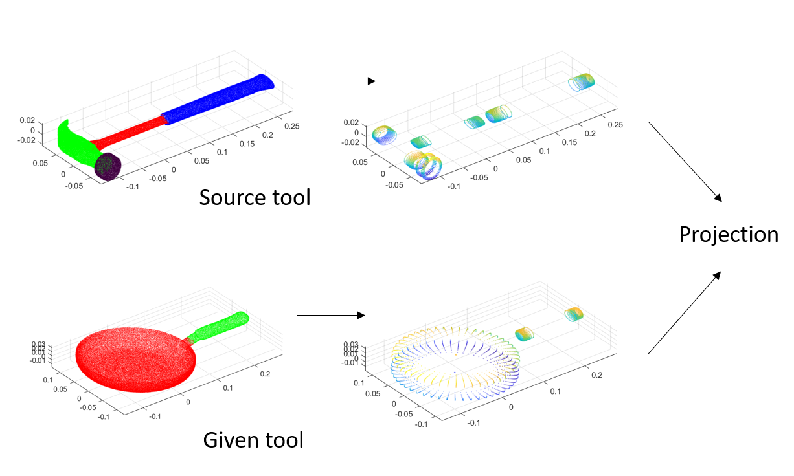

# LEVEL 0 MACGYVERING - OBJECT SUBSTITUTION #

Level 0 Macgyvering code that returns a substitute object for an input source object and also returns updated planning and domain definitions for the planner. Based on Abelha, Paulo, Frank Guerin, and Markus Schoeler. "A model-based approach to finding substitute tools in 3D vision data." Robotics and Automation (ICRA), 2016 IEEE International Conference on. IEEE, 2016.

Eg. Given tools = [frying_pan, mug, knife]; source object = hammer; returns frying_pan as the best substitute for hammer

## Approach ## 

1) Fit superquadrics (SQ) to source tool and given tools
2) Find best match between each given tool and source tool using ICP
3) Return best match as substitute tool
          
## Scripts ## 
1) main - specify the given tools, source tools and return best substitute
2) param_init - initial parameters for SQ
3) segment_return - return the point cloud segments for each input tool
4) pca_segment - compute segment pca for the initial orientation of objects
5) fitting_fn - Inside-outside fitting function for the SQ optimization
6) pcl_dist - metric used for finding which SQ (ellipsoid, paraboloid, toroid or hyperboloid) best matches point cloud segment
7) SQ_fitting - performs optimization using Levenberg-Marquardt
8) SQ2PCL - convert the SQ parameters into a point cloud
9) visualize_SQ - for visualizing two point clouds together
10) projection - performs projection for each given tool SQ to the source tool SQ using ICP to identify best match
11) plan_augment - returns updated planning domain and problem definitions including the substitute object
         
         
## Other files ## 
1) MGP_problem, MGP_domain.pddl - original problem and domain definitions in PDDL
2) MGP_new_act_prob, MGP_new_act.pddl - Modified problem and domain definitions including the substitute tool
3) Some tools from the Tools-Web dataset
             
             

       
