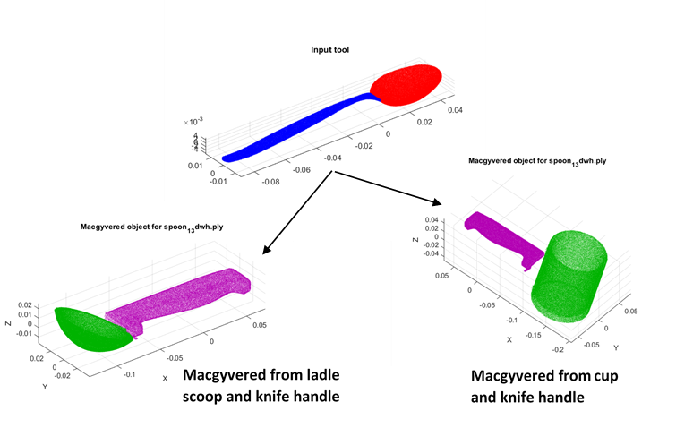

# LEVEL 1 MACGYVERING - CREATING NEW OBJECTS #

Returns a composite object made from a given set of input parts that can act as substitute for the source tool/object.

Eg. Given tools = [knife_handle, ladle_scoop, knife_blade]; source object = spoon; returns a composite object of knife_handle + ladle_scoop as the best substitute for spoon

## Approach ## 
1) Fit superquadrics (SQ) to source tool
2) Project the SQs to given set of individual parts and get fitting score
3) Check scale difference between individual part SQs and source tool SQs - get match score (Higher score for parts that match the size of source tool parts)
4) Find and select best combination of individual parts with highest total fitting and match scores
5) Compose the final object from the selected parts using source tool as reference
          
## Scripts ## 
1) main - specify the given individual parts, source tool and return composite object
2) param_init - initial parameters for SQ
3) segment_return - return the point cloud segments for each input tool
4) pca_segment - compute segment pca for the initial orientation of objects
5) fitting_fn - Inside-outside fitting function for the SQ optimization
6) pcl_dist - metric used for finding which SQ (ellipsoid, paraboloid, toroid or hyperboloid) best matches point cloud segment
7) SQ_fitting_params - performs optimization using Levenberg-Marquardt - returns fitting score for each individual part to the source tool SQs
8) SQ2PCL - convert the SQ parameters into a point cloud
9) visualize_SQ - for visualizing two point clouds together
10) projection - performs projection for each given parts SQ to the source tool SQ using ICP to identify best match (not used - replaced with SQ_fitting_params which gives fit scores)
11) parts_combo - returns best combination of parts with highest total fitting and match score
12) tool_scaling - scales point clouds based on sizes of the actual objects (prevent hammer and spoon from being the same size)         
         
## Other files ## 
1) Hammer and spoon point clouds from the Tools-Web dataset
             
             

       
